# راهنمای مصور و مرحله‌ای «وقت یار»

> مخاطب: مدیر کسب‌وکار (مطب، سالن، مشاوره، باشگاه و…)، نه برنامه‌نویس. همه‌ی تصویرها از خود رابط واقعی افزونه گرفته شده‌اند، روی یک کسب‌وکار فرضی («کلینیک نمونه»، نام‌ها و شماره‌ها ساختگی‌اند). جای تصویرها اگر عوض شد، با `pnpm guide:build` و `pnpm guide:shoot` دوباره ساخته می‌شوند.
>
> نسخه‌ی متنی و کوتاه‌تر همین راهنما داخل خود افزونه است (`user-guide-fa.md`). فهرست محدودیت‌ها و چیزهایی که هنوز نیست در [بازبینی برابری](../01-research/05-parity-audit.md) آمده است.

## فهرست

1. [نصب و فعال‌سازی](#۱-نصب-و-فعالسازی)
2. [راه‌اندازی اولیه (ویزارد)](#۲-راهاندازی-اولیه-ویزارد)
3. [زبان، تقویم و ظاهر](#۳-زبان-تقویم-و-ظاهر)
4. [تعریف کسب‌وکار: شعبه، پرسنل، خدمت](#۴-تعریف-کسبوکار-شعبه-پرسنل-خدمت)
5. [ساعت کاری، مرخصی و تعطیلات](#۵-ساعت-کاری-مرخصی-و-تعطیلات)
6. [قوانین رزرو](#۶-قوانین-رزرو)
7. [گذاشتن فرم رزرو روی سایت](#۷-گذاشتن-فرم-رزرو-روی-سایت)
8. [کار روزانه: داشبورد، تقویم، نوبت‌ها](#۸-کار-روزانه-داشبورد-تقویم-نوبتها)
9. [مشتریان](#۹-مشتریان)
10. [پیامک، ایمیل و اعلان‌ها](#۱۰-پیامک-ایمیل-و-اعلانها)
11. [گزارش‌ها](#۱۱-گزارشها)
12. [سلامت سیستم](#۱۲-سلامت-سیستم)
13. [مشکل‌های رایج](#۱۳-مشکلهای-رایج)

---

## ۱. نصب و فعال‌سازی

**نیازها:** PHP نسخه 8.1 یا بالاتر، وردپرس 6.6 یا بالاتر، MySQL 5.7 یا MariaDB 10.4 با موتور InnoDB. اگر چیزی کم باشد، افزونه به‌جای خراب‌کردن سایت در بالای پنل وردپرس می‌گوید چه لازم است.

1. در وردپرس **افزونه‌ها ← افزودن ← بارگذاری افزونه** را باز کنید و فایل zip را انتخاب کنید.
2. **نصب** و بعد **فعال‌سازی** را بزنید.
3. در منوی سمت راست پیشخوان، گزینه‌ای با نام **وقت یار** و آیکن تقویمِ «io98» پیدا می‌شود. (اگر زبان افزونه را انگلیسی بگذارید، نامش Vaqtyar است.)

> آیکن منو یک تقویم است که نام سازنده «io98» از آن بریده شده؛ با هر رنگ منوی وردپرس هماهنگ می‌شود. زیر نام افزونه در فهرست افزونه‌ها هم پیوند «ساخته‌شده توسط io98» هست که به io98.ir می‌رود.

---

## ۲. راه‌اندازی اولیه (ویزارد)

بار اول، از داشبورد روی **راه‌اندازی** بزنید (یا مستقیم `#/setup`). هفت گام دارد و **هر گام را می‌شود رد کرد** و بعداً از بخش مربوط به خودش انجام داد.

### گام ۱: زبان و تقویم

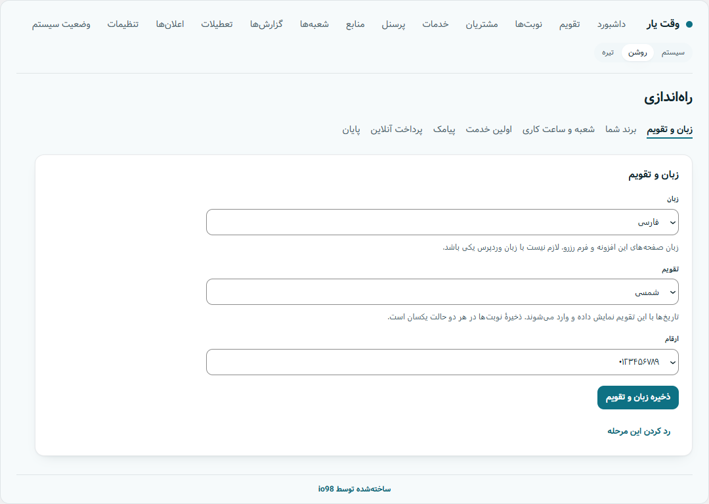

- **زبان:** «مانند سایت»، فارسی یا English. به زبان وردپرس بستگی ندارد؛ می‌شود وردپرس انگلیسی و افزونه فارسی داشت.
- **تقویم:** شمسی یا میلادی. همه‌ی تاریخ‌ها (فهرست‌ها، فیلترها، تقویم، فرم رزرو) با آن نمایش داده و وارد می‌شوند.
- **ارقام:** فارسی (۱۲۳) یا لاتین (123).

اگر **زبان** را عوض کنید، برای اعمال‌شدن باید صفحه را دوباره بارگذاری کنید (پیام و دکمه‌اش نشان داده می‌شود)؛ تقویم و ارقام بلافاصله عوض می‌شوند.

### گام ۲: برند شما

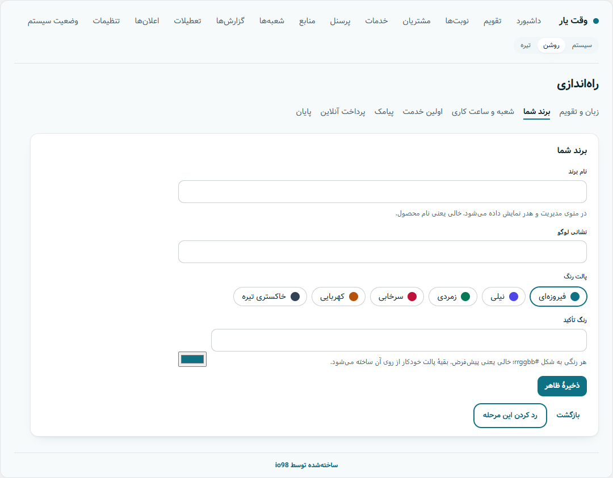

نام (جای «وقت یار»)، لوگو و **پالت رنگ**. ادامه‌اش در [بخش ۳](#۳-زبان-تقویم-و-ظاهر) هست.

### گام‌های بعدی

| گام | چه می‌کنید |
|---|---|
| مکان و ساعت کار | نام و نشانی شعبه و ساعت شروع و پایان (شنبه تا پنجشنبه) |
| اولین خدمت | یک پرسنل و یک خدمت با مدت (دقیقه) و قیمت (ریال) |
| پیامک | یکی از سرویس‌دهنده‌های پیامک |
| پرداخت آنلاین | زرین‌پال یا زیبال |
| پایان | رفتن به داشبورد |

---

## ۳. زبان، تقویم و ظاهر

همه‌ی اینها در **تنظیمات** هستند.

### ۳.۱ زبان و تقویم

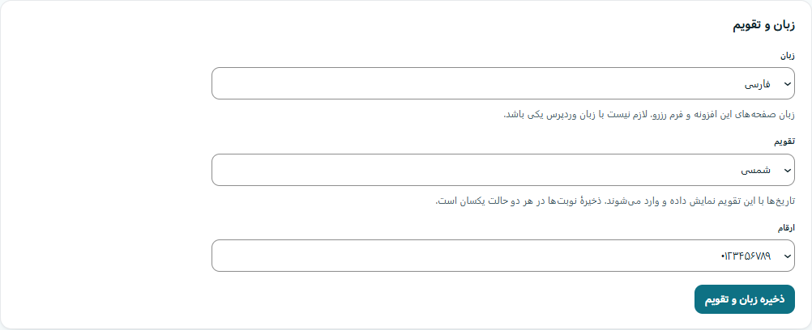

1. **تنظیمات** را باز کنید؛ اولین کارت «زبان و تقویم» است.
2. زبان، تقویم و ارقام را انتخاب و **ذخیره زبان و تقویم** را بزنید.

نتیجه در تقویم شمسی، فیلد تاریخ به شکل تایپی همراه شبکه‌ی ماه است:

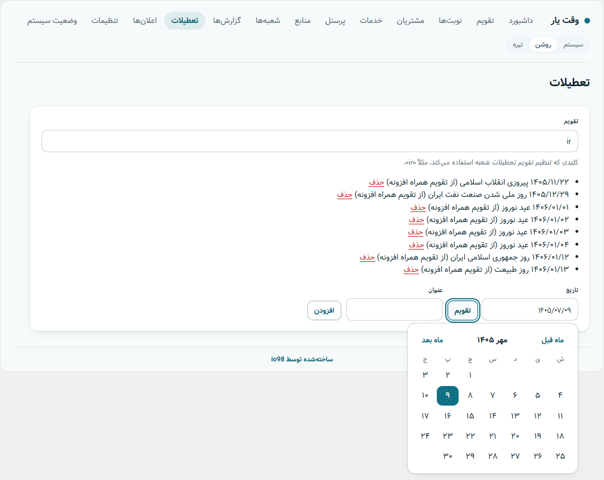

- تاریخ را می‌شود تایپ کرد، با هر ارقامی: `1405/07/09` یا `۱۴۰۵-۷-۹`.
- دکمه‌ی **تقویم** شبکه‌ی ماه را باز می‌کند؛ روی یک روز بزنید.
- روی سایت، فرم رزرو و پنل مشتری هم از همین تنظیم پیروی می‌کنند، مگر شورت‌کد `calendar="gregorian"` داشته باشد.

با تقویم میلادی و زبان English، همان صفحه چنین می‌شود:

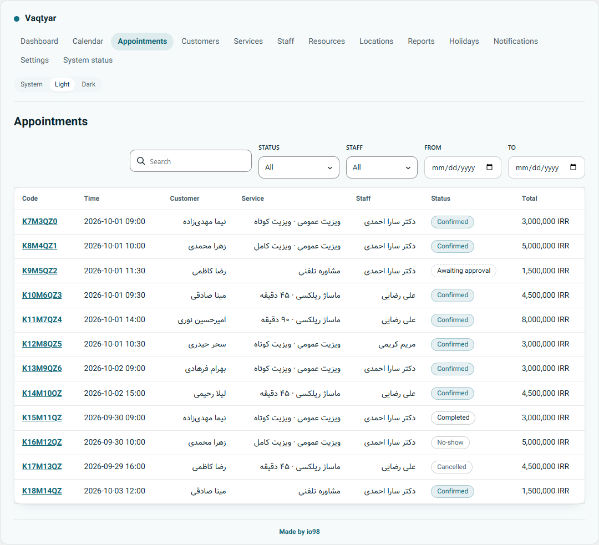

> ذخیره‌سازی نوبت‌ها در هر دو حالت یکی است (زمان UTC و تاریخ میلادی)، پس هر وقت خواستید تقویم را عوض کنید، داده‌ای خراب نمی‌شود.

### ۳.۲ برند و پالت رنگ

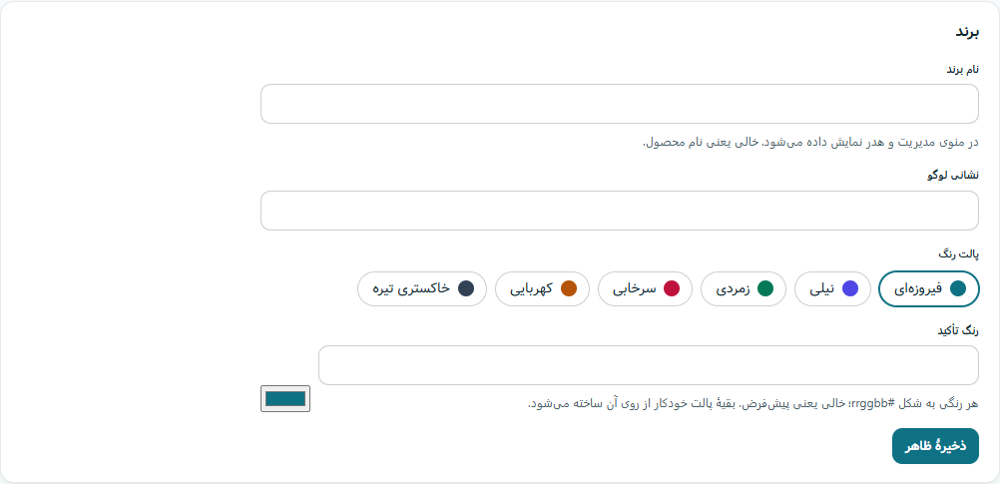

1. در کارت **برند**، اگر می‌خواهید نام شما جای نام محصول بیاید، **نام برند** را بنویسید؛ لوگو را با **انتخاب لوگو** یا آدرس بدهید.
2. **پالت رنگ:** یکی از شش پالت آماده را بزنید (فیروزه‌ای، نیلی، زمردی، سرخابی، کهربایی، خاکستری تیره) یا در **رنگ تأکید** هر رنگ `#rrggbb` بنویسید.
3. **ذخیره ظاهر** را بزنید.

فقط یک رنگ انتخاب می‌کنید؛ بقیه‌ی رنگ‌ها (حالت hover، زمینه‌های کم‌رنگ، نسخه‌ی تاریک) خودکار از آن ساخته می‌شوند و رنگ متن روی دکمه (سفید یا تیره) طوری انتخاب می‌شود که خوانا بماند. مثلاً با پالت «سرخابی»:

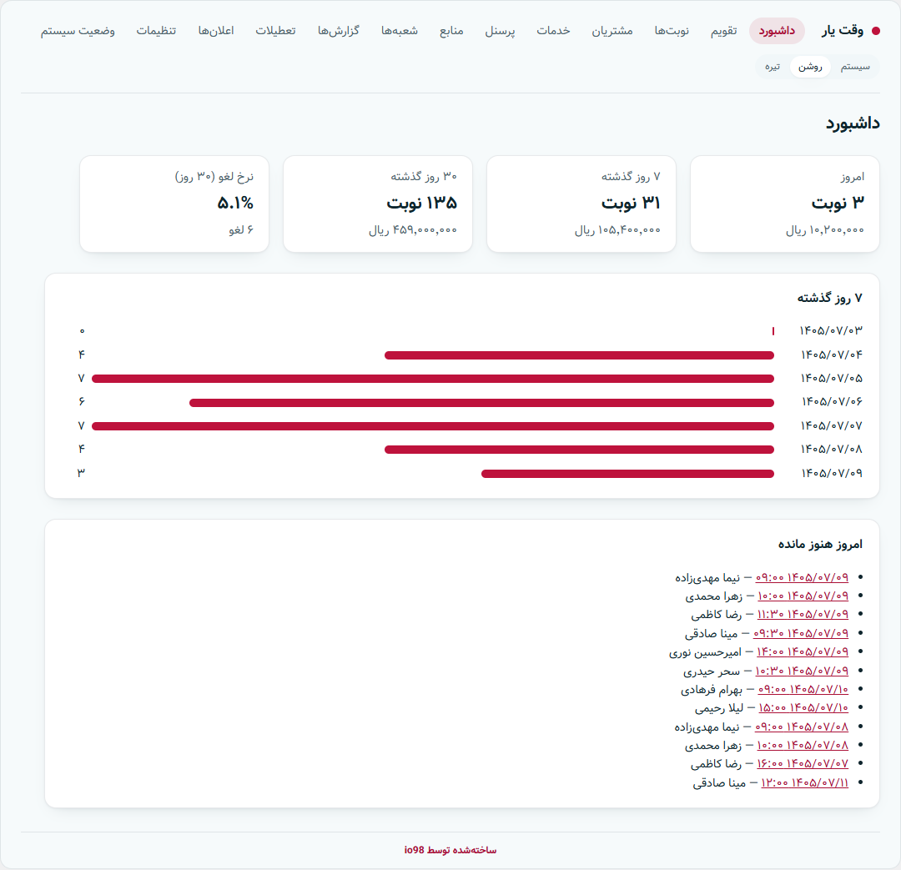

### ۳.۳ حالت تاریک

بالای هر صفحه سه دکمه هست: **سیستم / روشن / تیره**. «سیستم» از تنظیم کامپیوتر پیروی می‌کند. این انتخاب فقط در همان مرورگر ذخیره می‌شود.

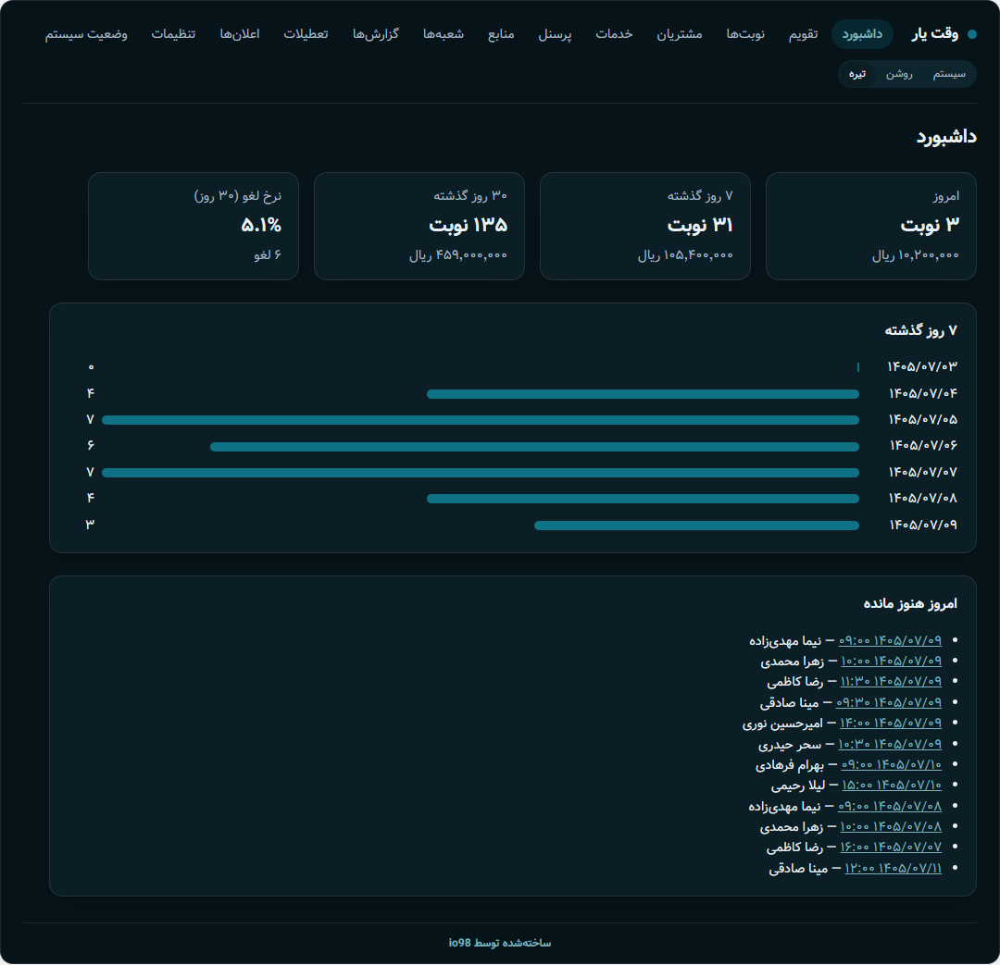

---

## ۴. تعریف کسب‌وکار: شعبه، پرسنل، خدمت

ترتیب پیشنهادی: **شعبه‌ها ← پرسنل ← خدمت‌ها** (و اگر اتاق یا دستگاه مشترکی لازم است: **منابع**).

1. **شعبه‌ها:** نام، نشانی و منطقه زمانی (ایران: `Asia/Tehran`). اگر یک شعبه دارید، مشتری چیزی درباره‌ی آن نمی‌بیند.
2. **پرسنل:** نام، عنوان و یک رنگ (در تقویم با همین رنگ دیده می‌شود).
3. **خدمت‌ها** را باز کنید و **افزودن خدمت** را بزنید.

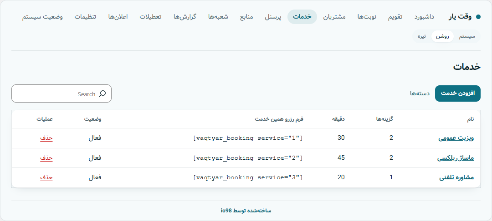

در فهرست خدمات، ستون **فرم رزرو همین خدمت** شورت‌کد همان خدمت را نشان می‌دهد؛ آن را در یک برگه بگذارید تا فقط همان خدمت رزرو شود.

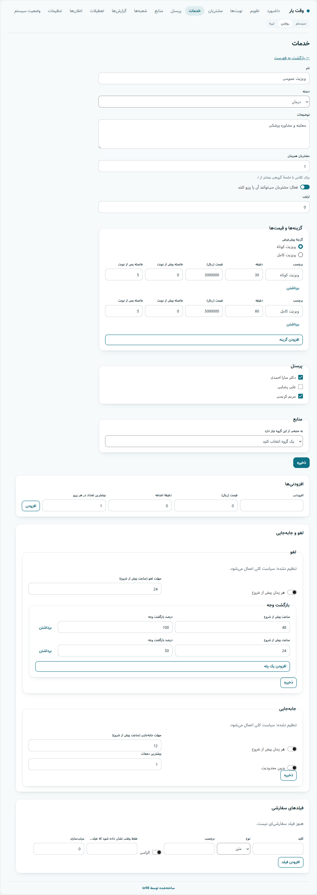

- **گزینه‌ها و قیمت‌ها:** هر خدمت یک یا چند «گزینه» دارد، مثلاً ویزیت ۳۰ و ۶۰ دقیقه‌ای با قیمت جدا؛ یکی را **پیش‌فرض** کنید. فاصله‌ی **پیش از نوبت** و **پس از نوبت** زمان آماده‌سازی است که به مشتری نشان داده نمی‌شود.
- **پرسنل:** کدام پرسنل این خدمت را انجام می‌دهند. می‌شود برای یک نفر قیمت یا مدت دیگری گذاشت.
- **منابع:** اگر خدمت اتاق یا دستگاه لازم دارد.
- **افزودنی‌ها:** چیزهای اختیاری با قیمت جدا (مثلاً روغن معطر).
- **لغو و جابه‌جایی:** سیاست همین خدمت (روی سیاست کلی مقدم است).
- **فیلدهای سفارشی:** سؤال‌های اضافه در فرم رزرو.

> قیمت‌ها به **ریال** هستند و عدد صحیح.

---

## ۵. ساعت کاری، مرخصی و تعطیلات

بدون ساعت کاری، **هیچ زمانی** به مشتری پیشنهاد نمی‌شود.

### ۵.۱ ساعت کاری هفتگی و مرخصی

در صفحه‌ی هر پرسنل:

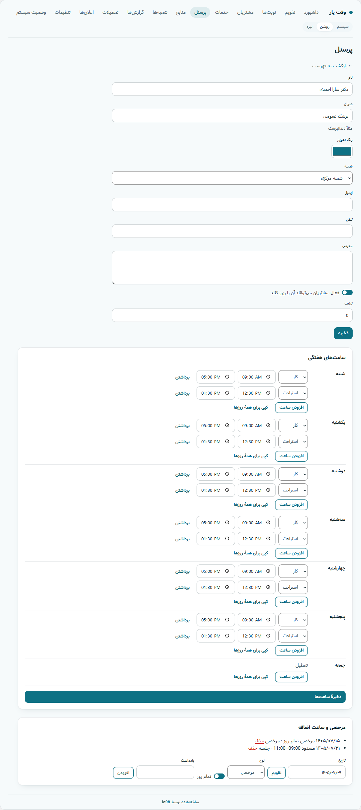

1. برای هر روز هفته یک یا چند بازه‌ی کار بگذارید؛ **استراحت** هم می‌شود (مثلاً ناهار).
2. **مرخصی و ساعت اضافه:** یک تاریخ (با فیلد تاریخ شمسی)، نوع (مرخصی، ساعت اضافه، زمان مسدود) و یادداشت.

### ۵.۲ تعطیلات رسمی

از منوی **تعطیلات**: تعطیلات رسمی سال 1405 همراه افزونه است؛ روز دلخواه خودتان را هم اضافه کنید. هر شعبه به یک «تقویم تعطیلات» (مثلاً `ir`) وصل است.

> تا پایان اسفند 1405 باید فایل تعطیلات 1406 به افزونه اضافه شود (نسخه‌ی بعدی).

---

## ۶. قوانین رزرو

**تنظیمات ← قوانین رزرو**

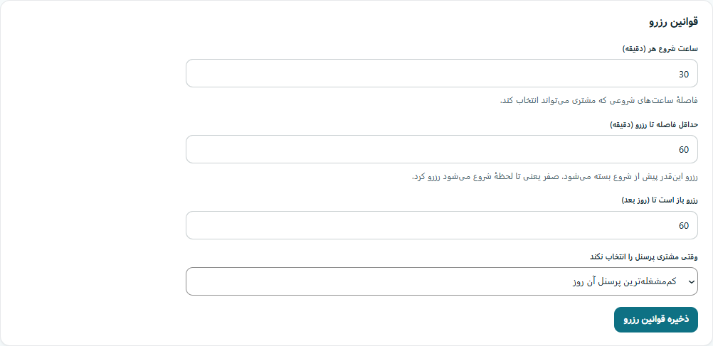

| تنظیم | معنی |
|---|---|
| ساعت شروع هر … دقیقه | فاصله‌ی ساعت‌هایی که مشتری می‌تواند انتخاب کند (۳۰ یعنی ۹:۰۰، ۹:۳۰، …). خدمتی که «گام اسلات» خودش را دارد روی این مقدم است |
| حداقل فاصله تا رزرو | رزرو این‌قدر پیش از شروع بسته می‌شود. صفر یعنی تا لحظه‌ی شروع |
| رزرو باز است تا … روز بعد | چند روز آینده مشتری می‌تواند رزرو کند |
| وقتی مشتری پرسنل را انتخاب نکند | «کم‌مشغله‌ترین آن روز» یا «به ترتیب فهرست پرسنل» |

در همین صفحه، پایین‌تر: **سیاست لغو و جابه‌جایی** (چند ساعت قبل، چند درصد برگردد)، **فیلدهای سفارشی**، **کوپن‌ها**، **قیمت زمانی** (مثلاً شب‌ها گران‌تر) و **پیامک** و **پرداخت آنلاین**.

---

## ۷. گذاشتن فرم رزرو روی سایت

1. یک برگه بسازید و این شورت‌کد را در آن بگذارید: `[vaqtyar_booking]` (یا در ویرایشگر، بلوک **Booking form** را اضافه کنید).
2. برای نوبت‌گیری فقط یک خدمت/شعبه/پرسنل: `[vaqtyar_booking service="1" location="1" staff="2"]`.
3. **صفحه‌ی تشکر:** `thanks="/تشکر/"`. بعد از رزرو، مشتری به این صفحه (حتماً از همین سایت) می‌رود و کد پیگیری به انتهای آدرس اضافه می‌شود. نوشتن آدرس سایت دیگر نادیده گرفته می‌شود.
4. برگه‌ی دیگری با `[vaqtyar_panel]` بسازید تا مشتری نوبت‌هایش را ببیند.

مشتری چنین صفحه‌ای می‌بیند: اول خدمت و گزینه و پرسنل، بعد روز و ساعت.

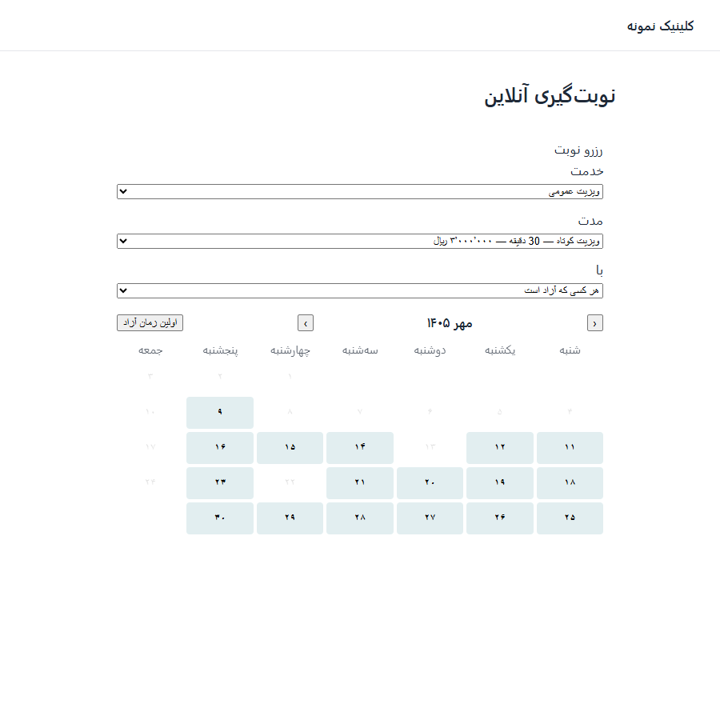

با انتخاب یک روز، ساعت‌های خالی نمایش داده می‌شود؛ بعد نام و موبایل (و در صورت فعال‌بودن، تأیید با کد پیامکی) و پرداخت:

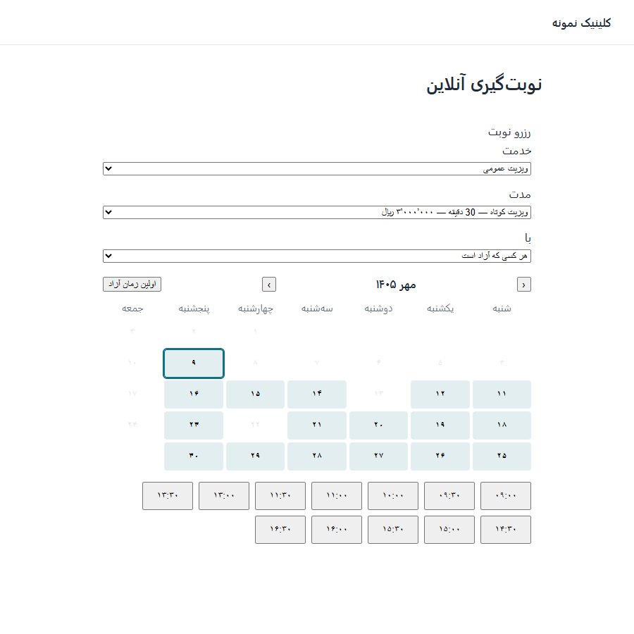

پس از رزرو، دکمه‌ی **افزودن به تقویم** یک فایل `.ics` می‌دهد که در تقویم گوشی و Google Calendar باز می‌شود.

### پنل مشتری

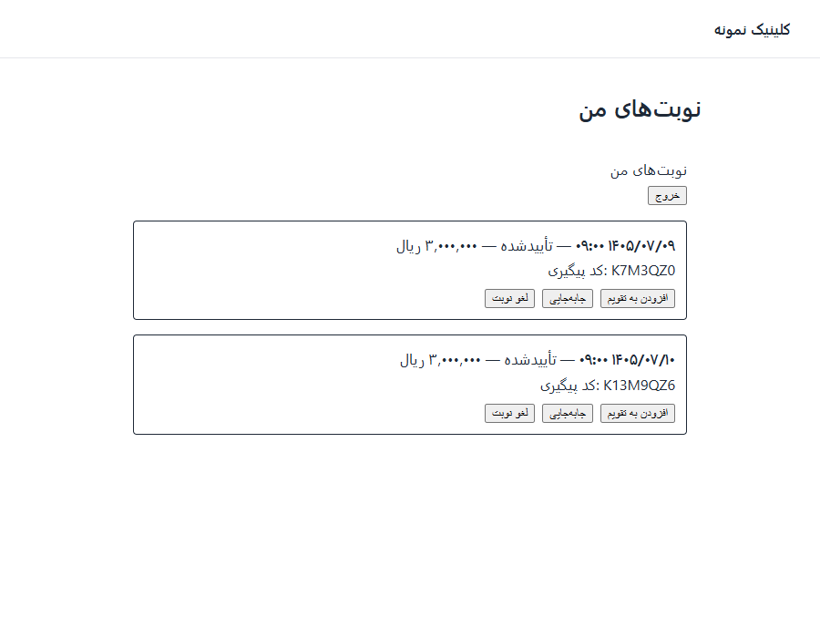

مشتری با موبایل و کد پیامکی وارد می‌شود (رمز ندارد) و نوبت‌هایش را می‌بیند، **جابه‌جایی** یا **لغو** می‌کند (تا جایی که سیاست شما اجازه بدهد) و به تقویم اضافه می‌کند.

> فرم و پنل فقط در صفحه‌ای بارگذاری می‌شوند که شورت‌کد دارد؛ بقیه‌ی سایت کندتر نمی‌شود.

---

## ۸. کار روزانه: داشبورد، تقویم، نوبت‌ها

### داشبورد

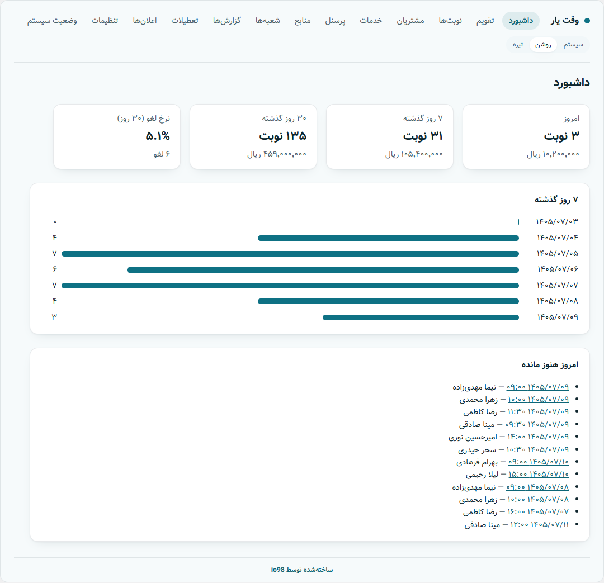

نوبت‌های امروز، هفته و ماه، درآمد، نرخ لغو و فهرست نوبت‌های باقی‌مانده‌ی امروز.

### تقویم

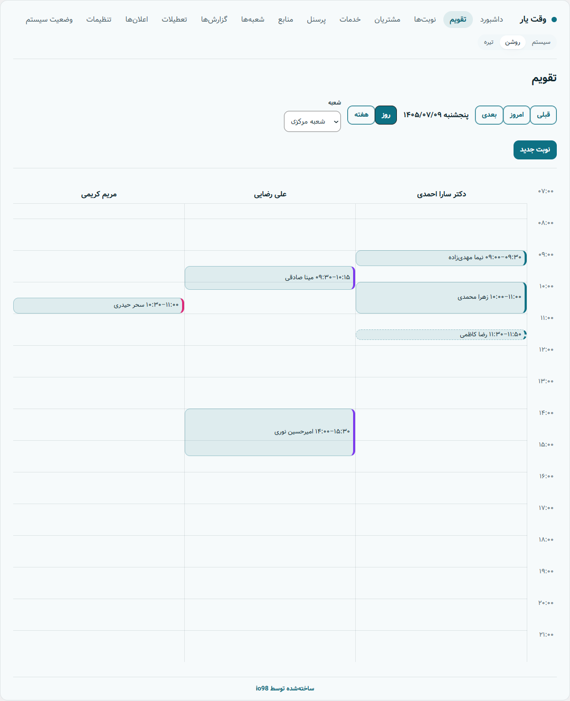

- نمای **روز** (ستون برای هر پرسنل) و **هفته**؛ **قبلی / امروز / بعدی** برای رفتن.
- رنگ خط کنار هر نوبت رنگ پرسنل است؛ خط‌چین یعنی منتظر تأیید.
- نوبت را بکشید و روی ساعت/ستون دیگر رها کنید تا جابه‌جا شود (اگر سیاست اجازه ندهد، دلیل می‌پرسد).
- روی یک خانه‌ی خالی بزنید تا نوبت سریع ثبت شود (مثلاً تلفنی):

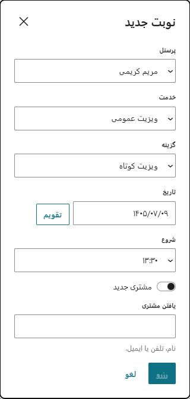

مشتری را با نام، موبایل یا ایمیل پیدا کنید، یا **مشتری جدید** را روشن کنید. نوبت تلفنی بدون پرداخت ثبت می‌شود.

### فهرست نوبت‌ها

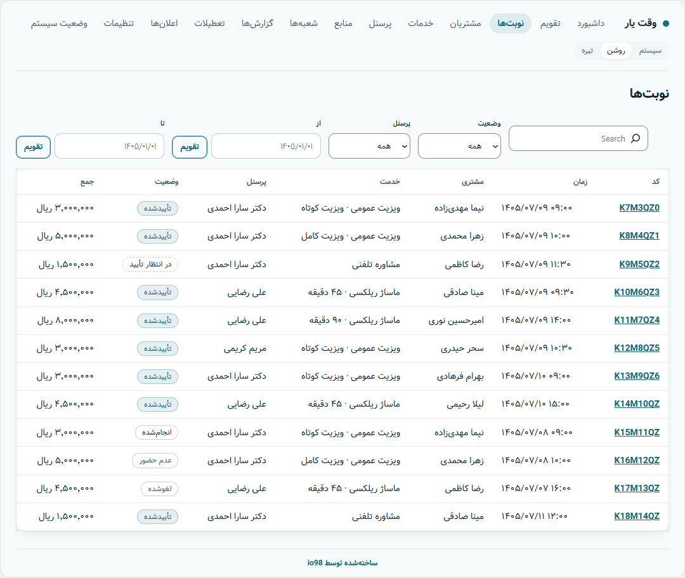

جستجو با کد پیگیری یا نام، فیلتر وضعیت و پرسنل، و بازه‌ی تاریخ (فیلد تاریخ شمسی). روی کد یک نوبت بزنید:

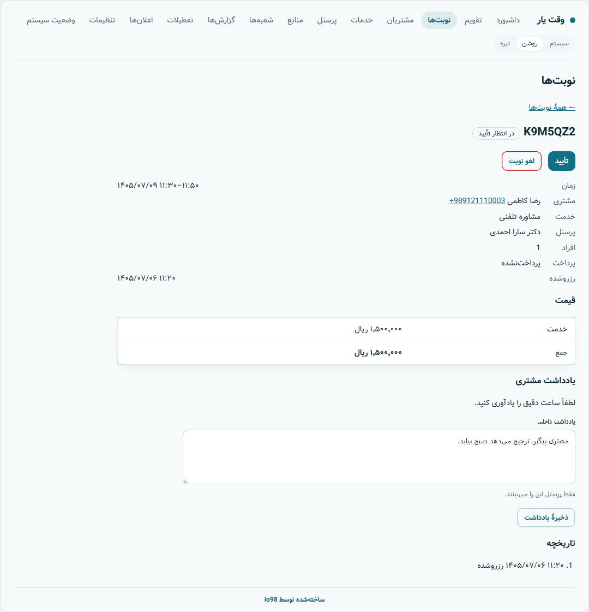

- **یادداشت داخلی** (مشتری نمی‌بیند).
- **Approve** برای نوبتی که منتظر تأیید است.
- بعد از شروع: **Mark completed** (انجام شد) یا **Mark no-show** (نیامد).
- **Cancel appointment** با دلیل.
- پایین صفحه، **تاریخچه‌ی** همه‌ی تغییرها.

وضعیت‌ها: قطعی، منتظر تأیید، منتظر پرداخت (زمان نگه داشته می‌شود و پس از ۳۰ دقیقه بدون پرداخت آزاد می‌شود)، انجام‌شده، نیامد، لغو و منقضی.

---

## ۹. مشتریان

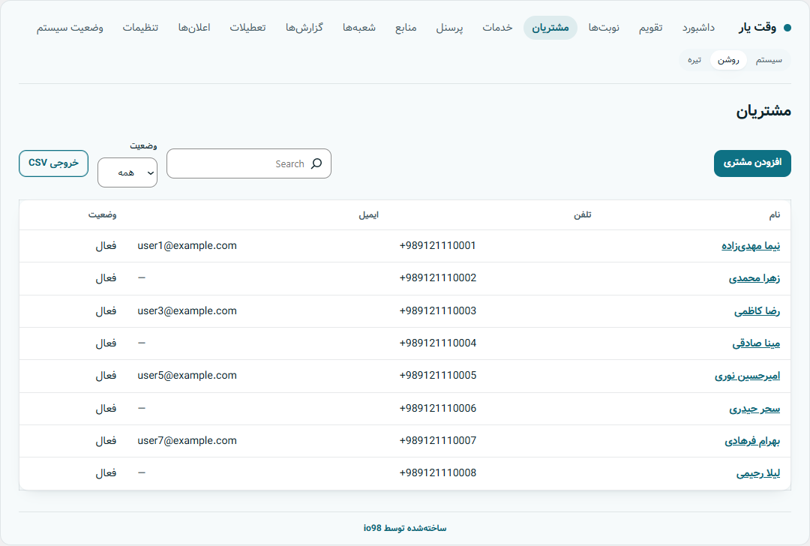

- جستجو با نام، موبایل یا ایمیل؛ فیلتر وضعیت.
- **افزودن مشتری** (برچسب، یادداشت، تاریخ تولد با فیلد تاریخ شمسی).
- **خروجی CSV** همه‌ی مشتریان مطابق جستجو و فیلتر فعلی را می‌دهد (نام، موبایل، ایمیل، برچسب، وضعیت).
- صفحه‌ی هر مشتری تاریخچه‌ی نوبت‌هایش را دارد.

---

## ۱۰. پیامک، ایمیل و اعلان‌ها

1. **تنظیمات ← پیامک:** یکی از کاوه‌نگار، IPPanel، SMS.ir یا ملی‌پیامک را تنظیم کنید و **Send test** بزنید. اگر چند سرویس‌دهنده تنظیم شود و اولی خطا بدهد، بعدی امتحان می‌شود.
2. **اعلان‌ها:**

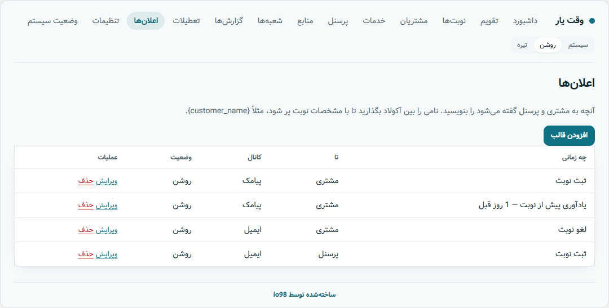

برای هر قالب معلوم می‌کنید **چه زمانی** (رزرو، لغو، جابه‌جایی، یادآوری)، **به چه کسی** (مشتری، پرسنل، مدیر)، **با چه کانالی** (ایمیل یا پیامک) و **چه متنی** برود. در متن می‌توانید جای‌نگه‌دارهایی مثل `{customer_name}`، `{service}`، `{date}`، `{time}` و `{code}` بگذارید. برای یادآوری، چند دقیقه پیش از شروع را هم می‌نویسید (۱۴۴۰ = یک روز).

برای پیامک، اگر سرویس‌دهنده‌ی شما فقط الگوی (pattern) تأییدشده می‌فرستد، در همان قالب کد الگو و نام مقدارها را بنویسید.

---

## ۱۱. گزارش‌ها

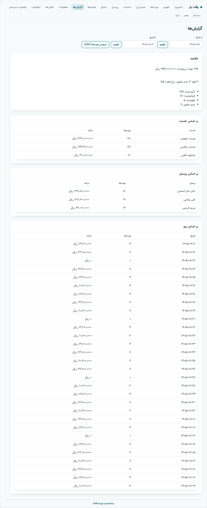

بازه‌ی تاریخ را انتخاب کنید: خلاصه، تفکیک بر اساس وضعیت، خدمت، پرسنل و روز، و **خروجی CSV** نوبت‌ها. درآمد همان مبلغ نوبت‌های قطعی و انجام‌شده است.

---

## ۱۲. سلامت سیستم

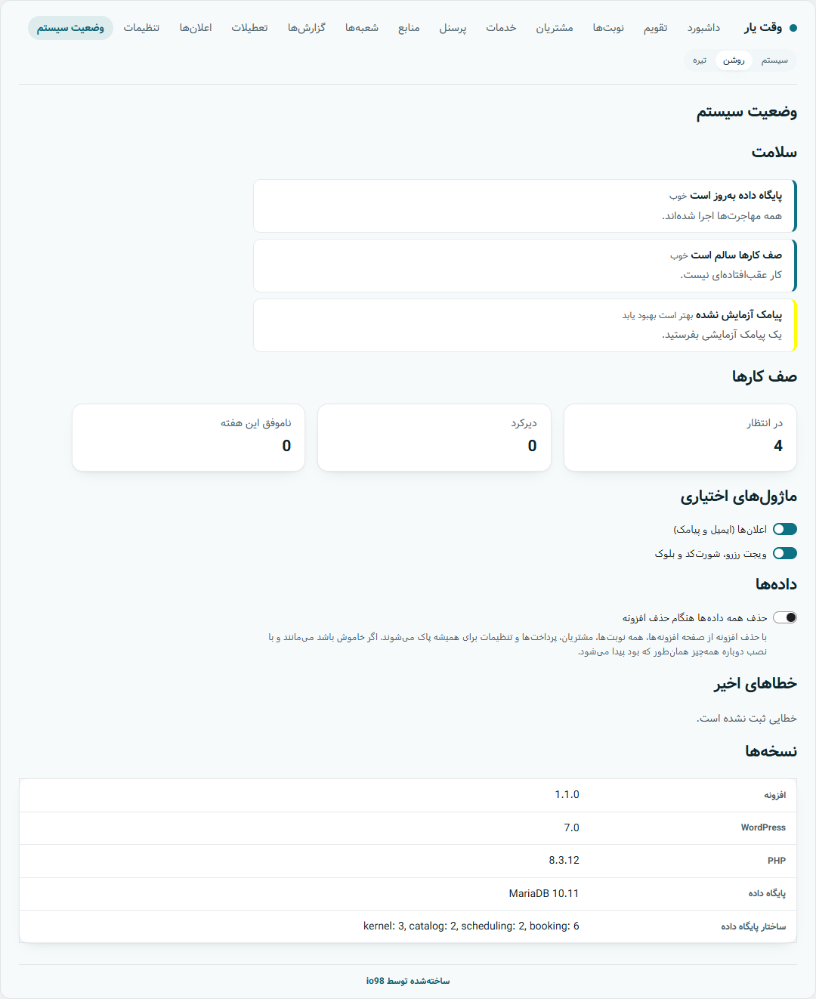

بررسی‌های سلامت، صف کارها (یادآوری‌ها و اعلان‌ها)، خاموش‌کردن ماژول‌های اختیاری، خطاهای اخیر، و کلید **حذف همه‌ی داده‌ها هنگام حذف افزونه** (پیش‌فرض خاموش).

---

## ۱۳. مشکل‌های رایج

| مشکل | علت و راه‌حل |
|---|---|
| هیچ زمانی در فرم نمی‌آید | پرسنل ساعت کاری ندارد، خدمت به پرسنل وصل نیست، روز تعطیل است، یا زمان‌ها بیرون از «قوانین رزرو» هستند |
| تاریخ‌ها میلادی‌اند | **تنظیمات ← زبان و تقویم** را بررسی کنید |
| زبان عوض نشد | بعد از ذخیره، صفحه را دوباره بارگذاری کنید |
| کد پیامک نمی‌رسد | سرویس‌دهنده یا خط ارسال یا کد الگو درست نیست؛ **Send test** و خطاهای System status را ببینید |
| یادآوری‌ها دیر می‌رسند | cron وردپرس فقط با بازدید اجرا می‌شود؛ یک cron سیستمی بگذارید |

---

ساخته‌شده توسط <a href="https://io98.ir">io98</a>

